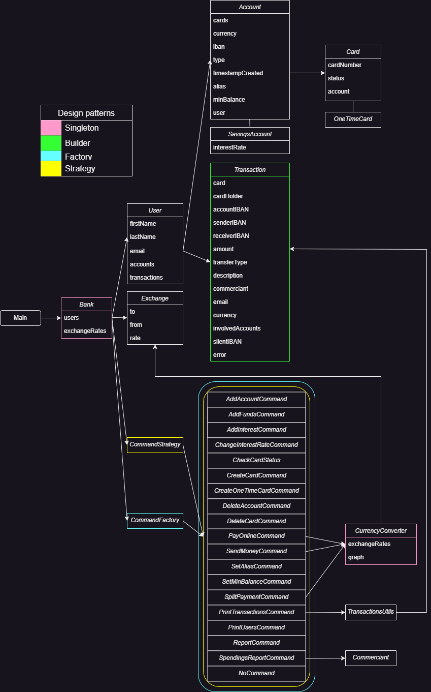

# Project stage 1
## Simplified banking system

The project is a simplified banking system that allows the user to:
- create an account
- delete an account
- create a savings account
- add money to the account
- transfer money between accounts
- create a virtual card for the account
- delete the virtual card
- pay with the virtual card
- split the bill with friends
- set an alias for the account
- set a limit for the account

### Commands
- `printUsers` - prints the info of all the users
- `printTransactions` - prints the transactions of a user
- `addAccount` - adds a new account for a user
- `addFunds` - adds funds to an account
- `createCard` - creates a new card for an account
- `createOneTimeCard` - creates a one-time card for an account
- `deleteCard` - deletes a card
- `deleteAccount` - deletes an account
- `payOnline` - makes an online payment with a card
- `sendMoney` - sends money from one account to another
- `checkCardStatus` - checks the status of a card
- `setMinBalance` - sets a minimum balance for an account
- `setAlias` - sets an alias for an account
- `splitPayment` - splits a payment between multiple accounts
- `report` - generates a report for an account
- `spendingsReport` - generates a spendings report for an account
- `addInterest` - adds interest to an account
- `changeInterestRate` - changes the interest rate for an account

## Class Diagram

### Design Patterns
- I used the **Singleton** design pattern for the Bank class, because there should be only one
bank in the system.
- For the commands I used the **Strategy** design pattern and the **Factory** design pattern.
The CommandFactory class creates the commands and the CommandStrategy interface has the
execute method that is implemented by all the commands.
- For the transactions I used the **Builder** design pattern, because each transaction has
multiple optional fields.
- For the CurrencyConverter class I used the **Singleton** design pattern to have only one
instance of the class that would convert the given currency.